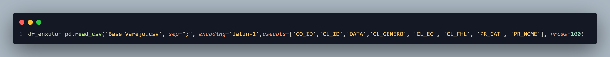

# Miniprojeto_RhommarMartinez_Visualiza-o-de-Dados-e-BI-T3-
Análise Exploratória de Dados (AED) aplicada ao varejo para aprender como transformar dados brutos em informações úteis.

Este projeto foi desenvolvido como parte do curso de Visualização de Dados e BI, com o objetivo de aplicar técnicas de Análise Exploratória de Dados (AED) no contexto do varejo. Através da análise de dados brutos, buscamos identificar padrões, tendências e insights que possam auxiliar na tomada de decisões estratégicas para o negócio.

Foi usado o arquivo base varejo.csv e criado outro arquivo a partir do original chamado limpo_varejo.csv, onde serão armazenados os dados tratados e limpos, prontos para análise.

Sera usado jupyter Notebook para realizar a análise exploratória dos dados, utilizando bibliotecas como pandas, matplotlib e seaborn para visualização e manipulação dos dados.

Esta é a descrição das colunas do arquivo 
Base varejo.csv:

1. DATA: Data da compra;
2. CO_ID: Identificação do número de compra (número da nota fiscal);
3. CL_ID: Identificação do cliente (número do cliente);
4. CL_GENERO: Sexo biológico informado pelo cliente;
2
5. CL_EC: Estado civil do cliente:
1: Casado ou união estával;
2: Divorciado;
3: Separado;
4. Solteiro;
5: Viúvo.
6. CL_FHL: Número de filhos do cliente;
7. CL_SEG: Segmentação econômica do cliente (classe A, B ou C);
8. PR_ID: Código do produto (SKU) adquirido;
9. PR_CAT: Categoria do produto adquirido;
10. PR_NOME: Nome do produto adquirido.

E necessario criar o ambiente ambiente virtual para instalar as bibliotecas necessárias para o projeto, garantindo que todas as dependências estejam corretamente configuradas.

no terminal 
escrever  
python -m venv .venv
ativar o ambiente virtual
no windows
.\venv\Scripts\activate 

instalar as bibliotecas necessárias
pip install pandas matplotlib seaborn

import pandas as pd
import numpy as np
import matplotlib.pyplot as plt
import seaborn as sns
import os
import re
import datetime

Para esta analise exploratoria de dados deste arquivo se tomaram apenas 100 linhas de registro. Para fazer para fines academicos e de aprendizado, pois o arquivo original contem mais de 1.000 linhas.

