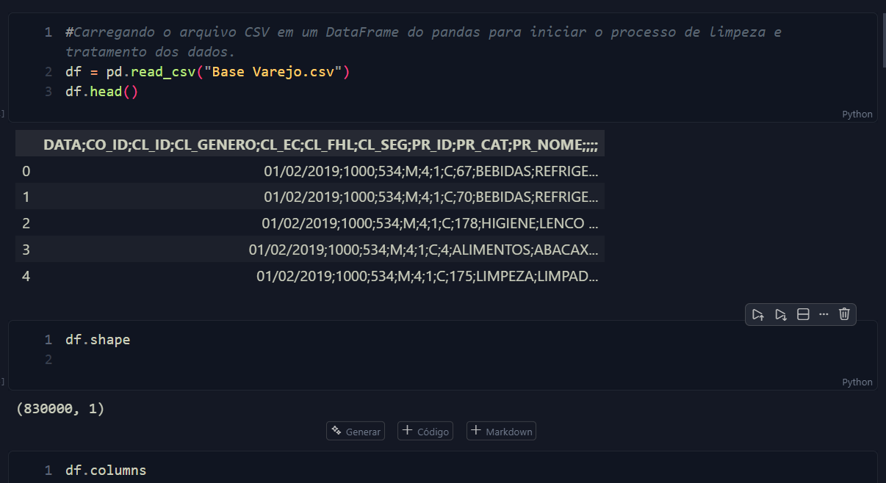

# Miniprojeto_RhommarMartinez_Visualiza-o-de-Dados-e-BI-T3-
Análise Exploratória de Dados (AED) aplicada ao varejo para aprender como transformar dados brutos em informações úteis.

Este projeto foi desenvolvido como parte do curso de Visualização de Dados e BI, com o objetivo de aplicar técnicas de Análise Exploratória de Dados (AED) no contexto do varejo. Através da análise de dados brutos, buscamos identificar padrões, tendências e insights que possam auxiliar na tomada de decisões estratégicas para o negócio.

CONTEXTUALIZAÇÃO
Você está desenvolvendo uma Análise Exploratória de Dados (AED) aplicada ao varejo para aprender como transformar dados brutos em informações úteis.

A base “Varejo” contém registros reais de compras (datas, clientes, produtos, categorias e valores). Aprender a verificar qualidade, limpar e sumarizar esses dados é uma habilidade prática essencial para quem trabalha com BI e Visualização de Dados.
Neste mini-projeto você vai praticar tarefas comuns no trabalho: identificar problemas nos dados (valores nulos, tipos incorretos, duplicados), tratar esses problemas com ferramentas como pandas e gerar estatísticas simples e funções de agrupamento, para responder perguntas operacionais (quem compra mais, quais categorias vendem mais, como variam as vendas ao longo do tempo).

O objetivo educacional é que, ao final, você saiba preparar uma base para análises mais avançadas ou para alimentar um dashboard: entender os dados, limpá-los, extrair estatísticas descritivas e comunicar os principais insights de forma objetiva.

DESAFIO
Entregar um script em Python que realize uma Análise Exploratória da base Varejo seguindo etapas claras, documentadas e reproduzíveis.

Etapas obrigatórias:
-Carregar a base Varejo.csv com pandas e mostrar: número de registros, colunas e tipos de dados.
-Verificar e reportar ao menos dois problemas básicos: valores nulos por coluna, duplicatas e possíveis inconsistências (ex.: datas inválidas ou categorias vazias).
-Fazer as três etapas de limpeza mínima necessária: remover ou imputar nulos (explique a escolha), eliminar duplicatas relevantes e ajustar tipos de dados (ex.: converter coluna DATA para datetime).
-Gerar estatísticas descritivas básicas para coluna de número de filhos do cliente (média; mediana; desvio padrão; moda; máximo; mínimo; e contagem).
-Explorar padrões de agrupamento com pelo menos dois agrupamentos (por exemplo: gênero com mais vendas, compras), usando groupby() ou pivot_table().
-Produzir um pequeno bloco de conclusões (3–6 tópicos) com os principais insights obtidos e possíveis problemas remanescentes na base.

Foi usado o arquivo base varejo.csv e criado outro arquivo a partir do original chamado limpo_varejo.csv, onde serão armazenados os dados tratados e limpos, prontos para análise.

Sera usado jupyter Notebook para realizar a análise exploratória dos dados, utilizando bibliotecas como pandas, matplotlib e seaborn para visualização e manipulação dos dados.

Esta é a descrição das colunas do arquivo 
Base varejo.csv:

1. DATA: Data da compra;
2. CO_ID: Identificação do número de compra (número da nota fiscal);
3. CL_ID: Identificação do cliente (número do cliente);
4. CL_GENERO: Sexo biológico informado pelo cliente;
2
5. CL_EC: Estado civil do cliente:
1: Casado ou união estával;
2: Divorciado;
3: Separado;
4. Solteiro;
5: Viúvo.
6. CL_FHL: Número de filhos do cliente;
7. CL_SEG: Segmentação econômica do cliente (classe A, B ou C);
8. PR_ID: Código do produto (SKU) adquirido;
9. PR_CAT: Categoria do produto adquirido;
10. PR_NOME: Nome do produto adquirido.

E necessario criar o ambiente ambiente virtual para instalar as bibliotecas necessárias para o projeto, garantindo que todas as dependências estejam corretamente configuradas.

no terminal 
escrever  
python -m venv .venv
ativar o ambiente virtual
no windows
.\venv\Scripts\activate 

instalar as bibliotecas necessárias
pip install pandas matplotlib seaborn

import pandas as pd
import numpy as np
import matplotlib.pyplot as plt
import seaborn as sns
import os
import re
import datetime

Etapas:

1# Carregar a base Varejo.csv com pandas e mostrar: número de registros, colunas e tipos de dados.

Foi carregado o arquivo Base varejo.csv com pandas e mostrado o número de registros, colunas e tipos de dados.
percevendo que o arquivo contem 830000 linhas e 1 coluna com uma lista que contem os nomes das colunas com os dados.

2# Verificar e reportar ao menos dois problemas básicos: valores nulos por coluna, duplicatas e possíveis inconsistências (ex.: datas inválidas ou categorias vazias).

Foi creado um script para esta analise exploratoria de dados deste arquivo onde se tomaram apenas 100 linhas de registro. Para fazer para fines academicos e de aprendizado, pois o arquivo original contem mais de 1.000 linhas.
Codigo de carregamento de de dados do arquivo:

Foram observado que 